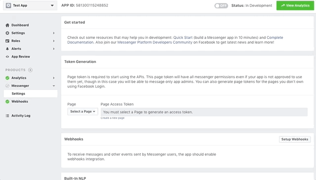

## Facebook Bot

### Table of Contents
1. [Getting started](#getting-started)
2. [Basic Usage](#basic-usage)
3. [Building a Fb Messenger Bot with JBot](#building-a-fb-messenger-bot-with-jbot)
    * [Setting up your bot](#setting-up-your-bot)
    * [Receiving messages](#receiving-messages)
    * [Sending messages](#sending-messages)
    * [Conversations](#conversations)
    * [Get Started Button](#get-started-button)
    * [Greeting Text](#greeting-text)
4. [Usage](#usage)
5. [Deploying in Production](#deploying-in-production)
6. [Documentation History](#documentation-history)

### Getting started

**Similar to Slack, Facebook is simple too but has few extra steps:**

1. Clone this project `$ git clone git@github.com:ramswaroop/jbot.git`.
2. Create a [facebook app](https://developers.facebook.com/docs/apps/register#create-app) and a 
[page](https://www.facebook.com/pages/create).
3. Generate a Page Access Token for the page (inside app's messenger settings).
    
    [](../../extras/fb-generate-token.gif)
    
4. Paste the token created above in [application.properties](/jbot-example/src/main/resources/application.properties) file.
5. Run the example application by running `JBotApplication` in your IDE or via commandline: 
    ```bash
    $ cd jbot
    $ mvn clean install
    $ cd jbot-example
    $ mvn spring-boot:run
    ```
6. Setup webhook to receive messages and other events. You need to have a secure public address to setup webhook. You may use [localtunnel.me](https://localtunnel.me) to 
generate a secure public address if you're running locally on your machine.
    
    
    
7. Specify the address created above in "Callback Url" field under "Webooks" setting and give the verify token 
as `fb_token_for_jbot` and click "Verify and Save".

    [](../../extras/fb-setup-webhook.gif)
    
You can now start messaging your bot by going to the facebook page and clicking on the "Send message" button. 

_If you're too lazy to start now and just want to play around, you can try `jbot-example` by visiting 
[JBot facebook page](https://www.facebook.com/jbotframework/) and clicking on the "Send Message" button._

### Basic Usage

The main function of a Bot is to receive and reply messages. With JBot, receiving messages is as easy as just
writing a simple `@Controller` and replying to it by calling the `reply()` method as shown below:

```java
@Controller(events = EventType.MESSAGE)
public void onReceiveMessage(Event event) {
    if ("hi".equals(event.getMessage().getText())) {
        reply(event, "Hi, I am JBot.");
    }
}
```

All the code for your bot goes in [FbBot](../../jbot-example/src/main/java/example/jbot/facebook/FbBot.java) class which
extends [Bot](../../jbot/src/main/java/me/ramswaroop/jbot/core/facebook/Bot.java) from the core package. You can have as many
bots as you want, just make the class extend [Bot](../../jbot/src/main/java/me/ramswaroop/jbot/core/facebook/Bot.java) class
and it gets all the powers of a Facebook Bot. Though it is recommended to have separate JBot instances for different bots.

### Building a Fb Messenger Bot with JBot

Before we deep dive into the details, be sure you have a facebook app, a fb page and have setup webhooks. See the 
[Getting Started](#getting-started) section to learn more.

#### Setting up your bot

In facebook, we can make messenger bots for pages and not for users. To start using fb APIs, we need a page access token
which can be generated from any of your fb app settings. This page access token needs to be specified in 
[application.properties](/jbot-example/src/main/resources/application.properties) file in jbot-example. You can remove 
"slack" from the `spring.profiles.active` as well. After this, you can start the bot by running `JBotApplication` from your IDE 
or via command-line.

Once the bot is started, you can go to the app's setting and setup webhooks. Give the secure url to your bot applcation,
you may use [localtunnel.me](https://localtunnel.me) to generate one if you're running on your machine and not on any 
server. You also need to provide a "Verify Token" which can be found in 
[application.properties](/jbot-example/src/main/resources/application.properties) file in `fbBotToken` property.

#### Receiving Messages

Facebook sends [Callback](../../jbot/src/main/java/me/ramswaroop/jbot/core/facebook/models/Callback.java) to `/webhook` 
for all the events your page has subscribed to. It sends as `POST` request to your `/webhook` endpoint.

Luckily, with JBot, you don't have to worry about defining your own handler to handle those `POST` calls, parsing the 
event etc. To receive events from Fb, you just have to define methods with `@Controller` annotation (from here on, we
will call them as `@Controller`).

i. Here is a simple example which gets invoked when your bot receives an event of type `MESSAGE` or `POSTBACK` from 
facebook.
```java
@Controller(events = {EventType.MESSAGE, EventType.POSTBACK})
public void onReceiveMessage(Event event) {
    if ("hi".equals(event.getMessage().getText())) {
        reply(event, "Hi, I am JBot.");
    }
}
```

ii. Another example which adds a `pattern` to the `@Controller`. Adding a pattern will restrict the method to be invoked
only when the event text or event payload (depending on the event type) matches the pattern defined. You can specify a
regular expression in `pattern`.
```java
@Controller(events = {EventType.MESSAGE, EventType.POSTBACK}, pattern = "^(?i)(hi|hello|hey)$")
public void onGetStarted(Event event) {
    // quick reply buttons
    Button[] quickReplies = new Button[]{
            new Button().setContentType("text").setTitle("Sure").setPayload("yes"),
            new Button().setContentType("text").setTitle("Nope").setPayload("no")
    };
    reply(event, new Message().setText("Hello, I am JBot. Would you like to see more?").setQuickReplies(quickReplies));
}
```
You can __optionally__ have a `matcher` as a formal parameter (after event) in the method if you want to work on the 
matched values sent by the user. You can access by `matcher.group(0)`, `matcher.group(1)` etc.

One thing to note here, the `pattern` will be matched against the `text` or `payload` depending on the event type 
received. For the below example, the event received will be of type `QUICK_REPLY` and the `pattern` in this case will be
matched against the `payload` attribute in `QuickReply` and not against the `text` attribute.
```java
@Controller(events = EventType.QUICK_REPLY, pattern = "(yes|no)")
public void onReceiveQuickReply(Event event) {
    if ("yes".equals(event.getMessage().getQuickReply().getPayload())) {
        reply(event, "Cool! You can type: \n 1) Show Buttons \n 2) Show List \n 3) Setup meeting");
    } else {
        reply(event, "See you soon!");
    }
}
```

You can see all the [webhook events](https://developers.facebook.com/docs/messenger-platform/reference/webhook-events) 
that the messenger platform currently supports. You may see that there is no specific `QUICK_REPLY` event type listed
there. This is an extra event added by JBot to make your task easier.

#### Sending Messages

Like receiving, for sending messages to users from your bot you need to make `POST` calls to the 
[Facebook's Send API](https://developers.facebook.com/docs/messenger-platform/reference/send-api). But again, with JBot,
you can simply reply by calling the `reply()` method from within your `@Controller` method. There are various overloaded
versions of the `reply()` method to suit your needs.

i. The **simplest** example is like,
```java
reply(event, "Hi, I am Jbot.");
```
It takes an event object and a string which is the reply text.

ii. Another example in which JBot replies with **two quick reply buttons**:
```java
// quick reply buttons
Button[] quickReplies = new Button[]{
        new Button().setContentType("text").setTitle("Sure").setPayload("yes"),
        new Button().setContentType("text").setTitle("Nope").setPayload("no")
};
reply(event, new Message().setText("Hello, I am JBot. Would you like to see more?").setQuickReplies(quickReplies));
```
If you see here, we have set `payload` in both the buttons. So, to know which button the user clicked you can have a
`@Controller` with event `EventType.QUICK_REPLY` and pattern as `(yes|no)` like below:
```java
@Controller(events = EventType.QUICK_REPLY, pattern = "(yes|no)")
public void onReceiveQuickReply(Event event) {
    if ("yes".equals(event.getMessage().getQuickReply().getPayload())) {
        reply(event, "Cool! You can type: \n 1) Show Buttons \n 2) Show List \n 3) Setup meeting");
    } else {
        reply(event, "See you soon!");
    }
}
```

iii. In this example, JBot replies with **two standard buttons**:
```java
Button[] buttons = new Button[]{
        new Button().setType("web_url").setUrl("http://blog.ramswaroop.me").setTitle("JBot Docs"),
        new Button().setType("web_url").setUrl("https://goo.gl/uKrJWX").setTitle("Buttom Template")
};
reply(event, new Message().setAttachment(new Attachment().setType("template").setPayload(new Payload()
        .setTemplateType("button").setText("These are 2 link buttons.").setButtons(buttons))));
``` 

iv. The last example shows JBot replying with a **list of three items**:
```java
Element[] elements = new Element[]{
        new Element().setTitle("AnimateScroll").setSubtitle("A jQuery Plugin for Animating Scroll.")
                .setImageUrl("https://plugins.compzets.com/images/as-logo.png")
                .setDefaultAction(new Button().setType("web_url").setMessengerExtensions(true)
                .setUrl("https://plugins.compzets.com/animatescroll/")),
        new Element().setTitle("Windows on Top").setSubtitle("Keeps a specific Window on Top of all others.")
                .setImageUrl("https://plugins.compzets.com/images/compzets-logo.png")
                .setDefaultAction(new Button().setType("web_url").setMessengerExtensions(true)
                .setUrl("https://www.compzets.com/view-upload.php?id=702&action=view")),
        new Element().setTitle("SimpleFill").setSubtitle("Simplest form filler ever.")
                .setImageUrl("https://plugins.compzets.com/simplefill/chrome-extension/icon-64.png")
                .setDefaultAction(new Button().setType("web_url").setMessengerExtensions(true)
                .setUrl("https://plugins.compzets.com/simplefill/"))
};
reply(event, new Message().setAttachment(new Attachment().setType("template").setPayload(new Payload()
        .setTemplateType("list").setElements(elements))));
```

Here is a screencast which shows all the examples we discussed:


You should have a look at [Facebook's Send API](https://developers.facebook.com/docs/messenger-platform/reference/send-api)
for all kinds of replies the bot can send. For example, you can even send a receipt to your user, airline boarding pass 
and much more.

#### Conversations

This is a differentiating feature of JBot, with this you can literally talk to your bot and have a conversation. See 
below for an example as to how your bot sets up a meeting for your team by asking some simple questions one after the 
other.


```java
/**
 * Type "setup meeting" to start a conversation with the bot. Provide the name of the next method to be
 * invoked in {@code next}. This method is the starting point of the conversation (as it
 * calls {@link Bot#startConversation(Event, String)} within it. You can chain methods which will be invoked
 * one after the other leading to a conversation.
 *
 * @param event
 */
@Controller(pattern = "(?i)(setup meeting)", next = "confirmTiming")
public void setupMeeting(Event event) {
    startConversation(event, "confirmTiming");   // start conversation
    reply(event, "Cool! At what time (ex. 15:30) do you want me to set up the meeting?");
}

/**
 * This method will be invoked after {@link FbBot#setupMeeting(Event)}. You need to
 * call {@link Bot#nextConversation(Event)} to jump to the next question in the conversation.
 *
 * @param event
 */
@Controller(next = "askTimeForMeeting")
public void confirmTiming(Event event) {
    reply(event, "Your meeting is set at " + event.getMessage().getText() +
            ". Would you like to repeat it tomorrow?");
    nextConversation(event);    // jump to next question in conversation
}

/**
 * This method will be invoked after {@link FbBot#confirmTiming(Event)}. You can
 * call {@link Bot#stopConversation(Event)} to end the conversation.
 *
 * @param event
 */
@Controller(next = "askWhetherToRepeat")
public void askTimeForMeeting(Event event) {
    if (event.getMessage().getText().contains("yes")) {
        reply(event, "Okay. Would you like me to set a reminder for you?");
        nextConversation(event);    // jump to next question in conversation  
    } else {
        reply(event, "No problem. You can always schedule one with 'setup meeting' command.");
        stopConversation(event);    // stop conversation only if user says no
    }
}

/**
 * This method will be invoked after {@link FbBot#askTimeForMeeting(Event)}. You can
 * call {@link Bot#stopConversation(Event)} to end the conversation.
 *
 * @param event
 */
@Controller
public void askWhetherToRepeat(Event event) {
    if (event.getMessage().getText().contains("yes")) {
        reply(event, "Great! I will remind you tomorrow before the meeting.");
    } else {
        reply(event, "Okay, don't forget to attend the meeting tomorrow :)");
    }
    stopConversation(event);    // stop conversation
}
```

**NOTE:**
* Only the first method in a conversation can define a `pattern`. `pattern` attribute in `@Controller` annotation has no
effect for rest of the methods in a conversation.
* The first method in the conversation need not call `nextConversation(event)` but rest of the methods do need to.
* `next` attribute in `@Controller` should have the name of the next method in the conversation that needs to be invoked.
* To end the conversation, call `stopConversation(event)` inside your controller method.

#### Get Started Button

You can set the "Get Started" button by simply calling the `setGetStartedButton("hi");` where "hi" is your payload. You
can see the `init()` method in [FbBot.java](../../jbot-example/src/main/java/example/jbot/facebook/FbBot.java). Just 
uncomment the `@PostConstruct` after you've setup your webhook.

The "Get Started" button is only shown to users new to your bot. 
[Learn more](https://developers.facebook.com/docs/messenger-platform/reference/messenger-profile-api/get-started-button).

#### Greeting Text

The `greeting` text allows you to specify a message people will see on the welcome screen of your bot. The welcome
screen is displayed for people interacting with your bot for the first time. You can set the `greeting` text like:
```java
setGreetingText(new Payload[]{new Payload().setLocale("default").setText("JBot is a Java Framework to help" +
                " developers make Facebook, Slack and Twitter bots easily. You can see a quick demo by clicking " +
                "the \"Get Started\" button.")});
```
You can define different `greeting` text for different locales. 
[Learn more](https://developers.facebook.com/docs/messenger-platform/reference/messenger-profile-api/greeting).

### Usage

You can directly clone this project and use [jbot-example](../../jbot-example) or you can include it as a maven/gradle 
dependency in your project.

**Maven**

```xml
<dependency>
    <groupId>me.ramswaroop.jbot</groupId>
    <artifactId>jbot</artifactId>
    <version>4.0.1</version>
</dependency>
```

**Gradle**

```groovy
dependencies {
    compile("me.ramswaroop.jbot:jbot:4.0.1")
}
```

__NOTE:__ When you include jbot as a dependency please make sure to include `me.ramswaroop.jbot` package for auto-scan.
For example, you can specify `scanBasePackages` in `@SpringBootApplication` or `@ComponentScan`. See 
[jbot-example](../../jbot-example/src/main/java/example/jbot/JBotApplication.java) to learn more.

### Deploying in Production

You can use `supervisord` or similar tools for deploying this app in production. Here is a sample `supervisord.conf`
for this application:

```.bash
[inet_http_server]
port=127.0.0.1:9001

[supervisord]
logfile=/tmp/supervisord.log 
logfile_maxbytes=50MB        
logfile_backups=10           
loglevel=info                
pidfile=/tmp/supervisord.pid 
nodaemon=false               
minfds=1024                  
minprocs=200

[rpcinterface:supervisor]
supervisor.rpcinterface_factory = supervisor.rpcinterface:make_main_rpcinterface

[supervisorctl]
serverurl=http://127.0.0.1:9001

[program:jbot]
command=mvn spring-boot:run    
;directory=/var/www/jbot.ramswaroop.me/jbot/jbot-example/       ; change this
autostart=true                 
autorestart=true               
;user=jbot                                                      ; change this
redirect_stderr=true           
stdout_logfile=/tmp/jbot.log
```

### Documentation History

* [README-facebook-JBot-4.0.0](./README-Facebook-JBot-4.0.0.md) _(Current)_

